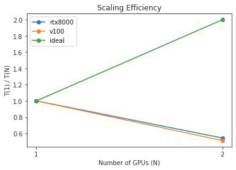
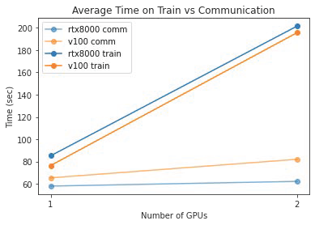
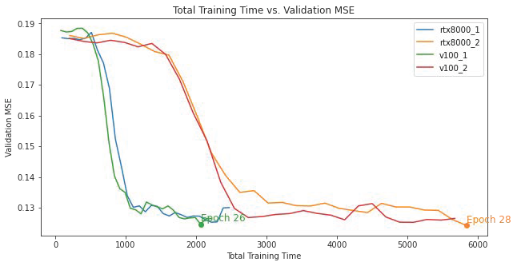
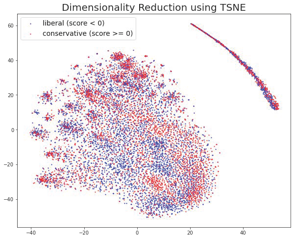

# Predicting Political Ideology of Large Social Media Networks
Group 5's final project for CSCI-GA 3033-091 Introduction to Deep Learning System, Spring 2022.

## Contributors 
[Charlotte Ji](https://github.com/mginabluebox)

[Aneri Patel](https://github.com/anerip98)

## Overview 
In this project, we examine the effectiveness of node embeddings as features in domain ideology scoring, following the work of Megan et al. [1]. Specifically, we use node2vec [2] to embed a Reddit subreddit-to-domain network and evaluate the downstream performance using Robertson et al.'s [3] ideology scores for common domains as the ground truth. 

Megan et al. [1] compared performance of 5 different network embeddings (DeepWalk, node2vec, LINE, SINE, GraphSAGE) in ideology scoring tasks on both Reddit and Twitter networks. They found that LINE outperformed other methods in domain ideology scoring for the Reddit subreddit-to-domain network. However, only default hyperparameters were evaluated for each embedding method, although some methods require careful tuning to maximize their performance. In particular, we are interested in exploring node2vec's [2] potential to achieve a better performance on this task, since it performs differently with different random walk lengths and exploration-exploitation ratio.

## Experiment Design 

### Basic Training Framework
- Node2vec is trained unsupervised on the Reddit subreddit to domain dataset. The dataset contains 1,000,161 edges (subreddit-domain pairs) and 300,353 nodes. 
- The downstream task for the embeddings is to predict the ideology of a domain node. We have ideology scores for 9,804 out of domains in the Reddit dataset for evaluation. 
- Following [1], we use domain ideology scores from Robertson et al.'s [3] paper. To monitor the embedding performance on downstream task, we split the evaluation domains into train (64%), validation (16%) and test (20%). 
- In each epoch of training, we train a predictor on train and report the mean squared error on both train and validation. 

### Experiment Framework
- First, we tune for the best node2vec parameters one by one, controlling for other parameters. We early stop at epoch 30 to trade computation resources per experiment (B) for more experiments (n). The model parameters include p, q (which control how fast the random walk explores and leaves the neighborhood of starting node), and random walk length. We also tune learning rate and batch size.
- With the best performing parameters, we evaluate the effectiveness of data parallelism by measuring train time vs communication time with 1 and 2 GPUs.
- We obtain the best performing node2vec model by training for a longer epoch (100).
- With the best performing model, we tune the respective parameters for the 3 types of predictors and identify the best predictor. We evaluate Ridge Regression, Random Forest and Gradient Boosting as predictors, and tune alpha for Ridge, n_estimators for RF, and n_estimator & learning rate for GB.

## Repo Structure
    .
    ├── data                                                          
        ├── reddit_index.json                                         # map from domain url to integer index
        ├── reddit_subreddit_to_domain__gt-01-urls.csv                # training network
        └── robertson_et_al.csv                                       # domain ideology scores for use as labels
    ├── graphs                                                        
    ├── data_parallel                                                 
        ├── run_[1,2]_[v100,rtx8000].sbatch                           # sbatch scripts for submitting jobs on HPC
        ├── reddit.py                                                 # main python script for training
        ├── node2vec_impl_dp.py                                       # data parallel implementation of pytorch geometric node2vec
        └── data_parallel_analysis.ipynb                              # main python script for training
    ├── predictor_tuning                                              
        ├── best_performing_model.ipynb                               # train and save model with best performing parameters
        └── classifier_tuning.ipynb                                   # grid search for best predictor using embeddings from best performing model
    └── embedder_tuning                                              
        ├──embed_batch_size.ipynb                                     # tuning for batch size
        ├──embed_learning_rate.ipynb                                  # tuning for learning rate
        ├──embed_p.ipynb                                              # tuning for p
        ├──embed_q.ipynb                                              # tuning for q
        └──embed_walk.ipynb                                           # tuning for walk

## Examples

## Results
### Hyperparameter Tuning
We finetuned hyperparameters (p, q, walk length, learning rate, batch size) for the embedding algorithm (Node2Vec). Our results are derived from the graphs mentioned below:  

We find that batch size 32 converges to flatter local minima while larger batch sizes converge to steep local minimas. Thus, we select batch size 32 as optimal for training.

### Data Parallellism
We parallelized training on 1 and 2 RTX8000 and V100 GPUs using PyTorch’s DataParallel. We observed that using more GPUs caused total training time to go up, so the scaling efficiency (Figure 1) goes down with 2 GPUs. To understand why, we separately measured **train time** (forward + backward + optimizer step) and **communication time** (data loading and CPU-GPU transfer) (Figure 1).

 

*Figure 1: Scaling efficiency (time to complete 1 iteration with 1 GPU / time to complete 1 iteration with N GPUs) for RTX8000 and V100 vs ideal (left), and train / communication time by GPU (right).*

*Figure 2: Validation MSE vs total training time for 1 and 2 RTX8000 and V100 GPUs. Epoch X represents #epochs to reach validation MSE of 0.125.*

### Best Performing Model
- Best Configuration: p=1, q=1, walk_length=50, batch_size=32, lr=0.0025
- Test Performance: 0.1262

*Figure 3: We visualized the best performing embeddings for the 9,804 labeled domains using the results of dimensionality reduction with T-SNE and observed certain clusters that are distinctively liberal or conservative.*

## References
[1] Megan A Brown et al. “Network Embedding Methods for Large Networks in Political Science”. In: Available at SSRN 3962536 (2021).

[2] Aditya Grover, Jure Leskovec. "node2vec: Scalable Feature Learning for Networks". KDD : Proceedings. International Conference on Knowledge Discovery & Data Mining. 2016: 855–864. arXiv:1607.00653  (2016)

[3] Ronald E. Robertson et al. “Auditing Partisan Audience Bias within Google Search”. In: Proc. ACM Hum.-Comput. Interact.2.CSCW (Nov. 2018). doi: 10.1145/3274417. url: https://doi.org/10.1145/3274417.
